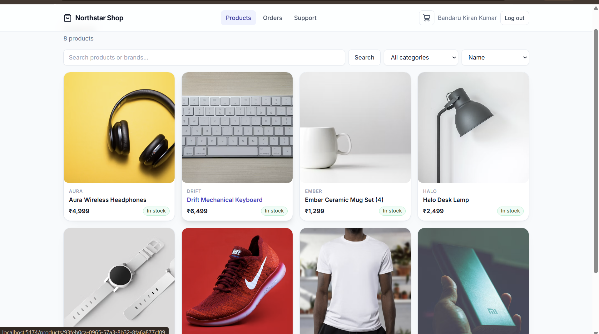
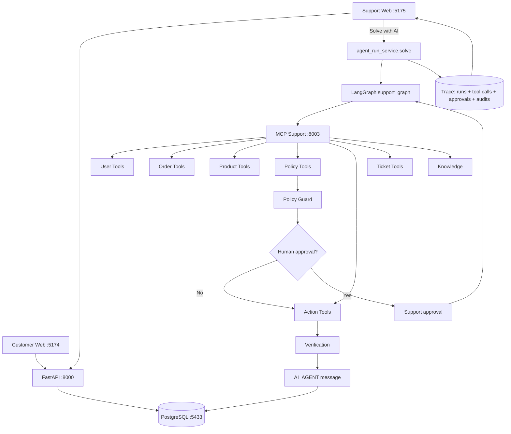
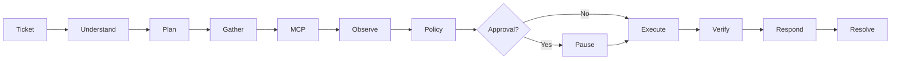
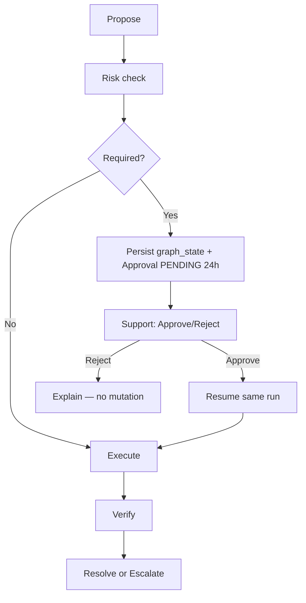
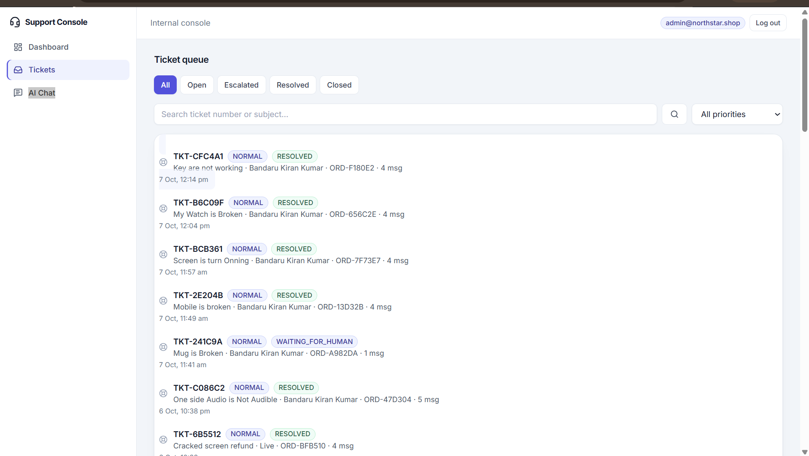
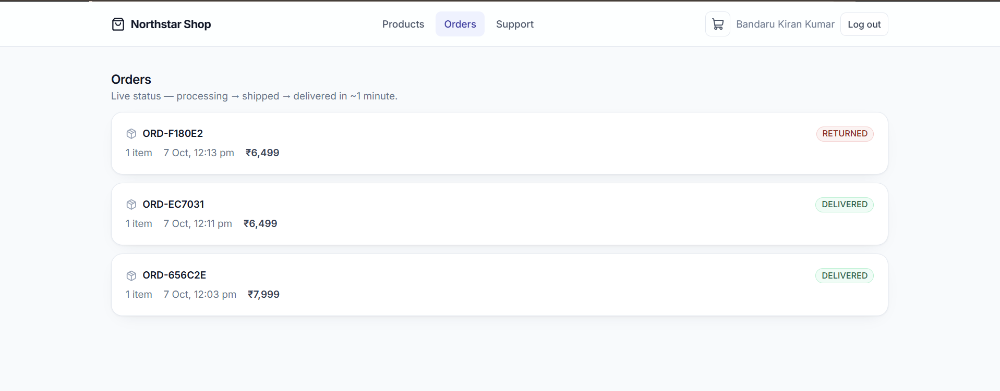
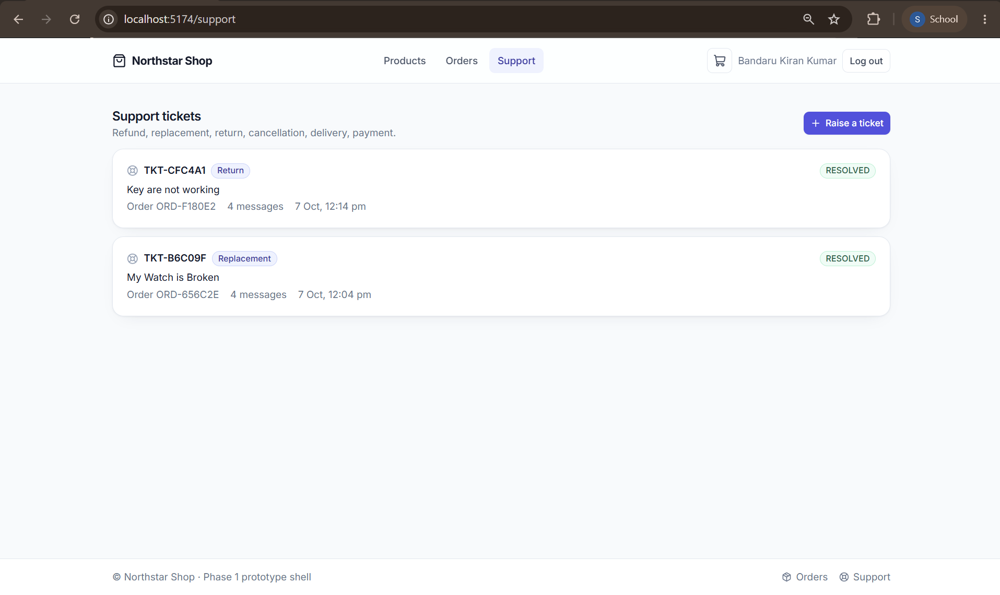
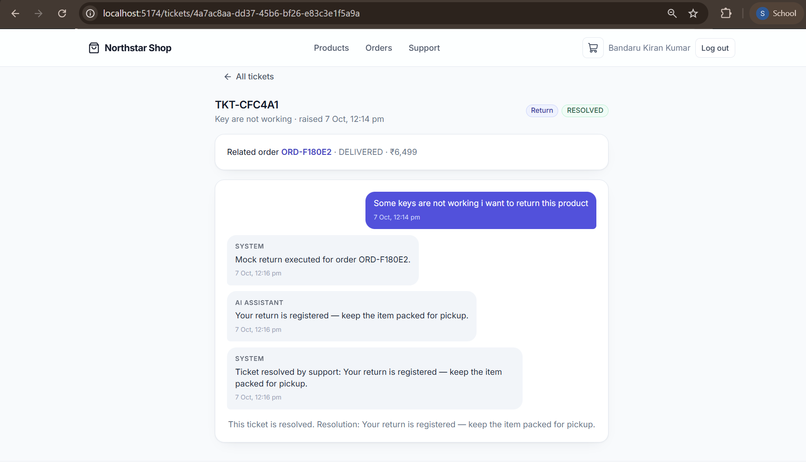
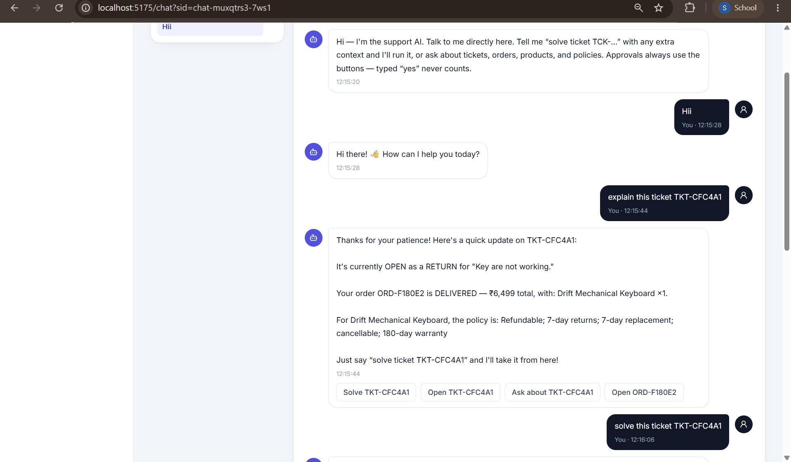
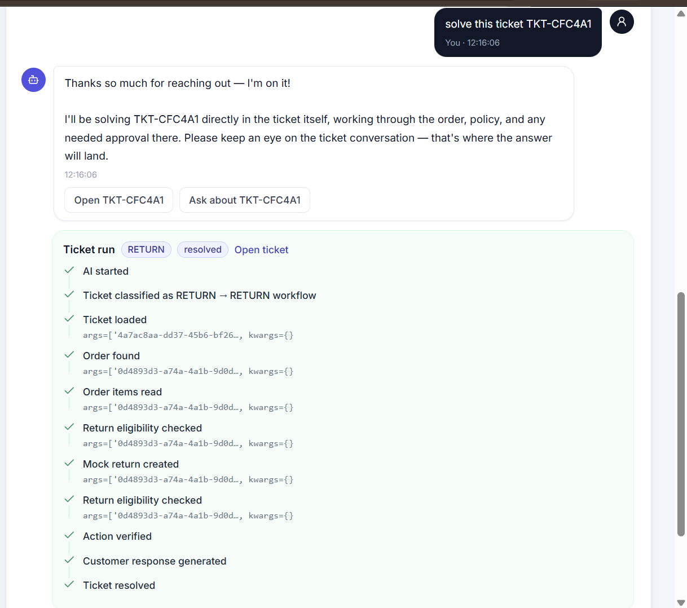

# Northstar — Autonomous AI Support Worker

> A focused prototype of an autonomous task worker for ecommerce support. Give it a ticket goal — "solve this" — and it investigates the order, checks policy, handles approval when needed, executes, verifies, and writes the resolution back to the customer.

[](#demo)
[](#architecture)
[](#technology-stack)

---

## Demo

**Video:** https://drive.google.com/file/d/1CWt96J_haSaje6e46PplN6DXoRO8StBe/view?usp=sharing

**Repository:** https://github.com/bkk07/northstar-worker

The demo traces one complete loop:

```
Customer → Purchase → Order delivered → Raise ticket → Support: Solve with AI
  → LangGraph investigates → MCP + policy checks → HITL if needed
  → Action → Verify → AI message in ticket → Customer sees result
```

Local copy (optional): `docs/demo.mp4`

---

## Overview

Northstar is **not a chatbot**. A chatbot answers a question with text. This worker is measured on whether it achieves the requested outcome.

Support does not script the steps. The input is the outcome:

> **"Solve ticket TKT-CFC4A1 — keys not working, return requested."**

The worker figures out what context is needed, calls tools, checks business rules, pauses for a human when the action is risky, executes through a controlled interface, verifies the new state, and persists an `AI_AGENT` message that the customer reads. The ecommerce shop exists to make that loop realistic.


*Customer storefront — 8 products, search and category filters. This is where orders that later become tickets are created.*

---

## Architecture

### High-level



One canonical path for `TKT-XXXXXX` tickets. The legacy worker task plane (`MCP :8002`, 18 tools including `browser_*`) is not used for ticket solves — the 24-tool support plane is.

### Ticket execution



### How HITL actually pauses



Chat text like "yes" never approves. The UI enforces button-only decisions — `chat_intent` maps bare confirmations to read-only follow-ups.

---

## What it does — end to end

A concrete run from the screenshots below:

1. Customer creates ticket `TKT-CFC4A1` — "Keys are not working, I want to return."
2. Support opens `/tickets/TKT-CFC4A1` and clicks **Solve with AI**.
3. LangGraph classifies `RETURN → RETURN workflow`, gathers ticket → order `ORD-F180E2` → items → product → policy.
4. `check_return_eligibility` confirms eligible. Policy says approval is not required for this amount/confidence, so no pause.
5. `mock_return` executes, then re-checks eligibility — now ineligible (as expected after a return) — verified.
6. An `AI_AGENT` message is written to the same ticket. Support sees the trace; the customer sees the resolution.

The two AI chat screenshots show the same path driven from `/chat` instead of the ticket page — `solve this ticket TKT-CFC4A1` launches the identical canonical run.


*Support queue — TKT-CFC4A1 is RESOLVED after the run, TKT-241C9A is WAITING_FOR_HUMAN where approval was required. Filters and priority are real queries against `biz.customer_tickets`.*

---

## Customer app

Separate Vite app at `:5174`.

```
 /login  /signup  /products  /products/:id  /cart  /checkout  /orders  /orders/:id  /support  /tickets/:id
```

- JWT + Argon2 auth, signup always `CUSTOMER`.
- Product browsing with mock data, cart and checkout create real `shop_orders`.
- Orders transition `processing → shipped → delivered` in ~60s so tickets have meaningful context.


*Orders — live status that flips to DELIVERED. Ticket TKT-CFC4A1 was filed against ORD-F180E2 after it hit this state.*


*Customer support list — the same TKT-CFC4A1 the support console sees, now visible to the customer.*


*Customer ticket view — the SYSTEM mock execution and the AI_ASSISTANT reply ("Your return is registered — keep the item packed for pickup") that the worker wrote. No copy-paste step.*

---

## Support console

Separate Vite app at `:5175`, `SUPPORT_AGENT` only.

```
 /login  /dashboard  /tickets  /tickets/:id  /chat
```

- Queue, ticket detail with Customer Context + Order Context panels, conversation, manual reply/note/resolve/escalate.
- **Solve with AI** drives `POST /support/tickets/:id/solve` and streams `GET /support/tickets/:id/trace` + SSE `GET /support/tickets/:id/activity`.
- `/chat` is ticket-grounded: `explain this ticket TKT-...`, `solve this ticket TKT-...`, follow-up "yes" resolved against thread history, action buttons per reply.


*Support chat — "explain this ticket TKT-CFC4A1" returns order status, amount, items, and policy in one call, with action buttons. The explanation is deterministic — the model only rephrases it.*


*Same chat moments later — "solve this ticket TKT-CFC4A1" ran directly in the ticket. The panel shows the persisted trace: ticket loaded → order found → return eligibility → mock_return → verified → resolved.*

The trace is not generated text. It is `biz.tool_calls` + `biz.approvals` + `biz.audit_logs` rendered from `GET /trace`.

---

## How this maps to the problem statement

| Requirement | How it is implemented |
|---|---|
| Understand goal | `support_graph/supervisor` classifies intent + workflow + confidence |
| Break into actions | 9-node DAG (`load_ticket → supervisor → gather → check_policy → propose → human_approval → execute → verify → respond`) with goal-oriented tool plan per intent |
| Use tools | MCP support `:8003` — 24 tools: user, order, product, policy, action, ticket, knowledge |
| Observe results | Tool results persisted to `tool_calls` and fed into next node |
| Decide next step | Conditional edges on `approval_required`, `eligible`, `escalated` |
| Remember context | `SupportGraphState` JSON checkpoint in `agent_runs.graph_state` — resume restores it |
| Detect failures | `error` + `needs_human`/`escalated` branches, `FAILED` run state |
| Retry / recover | Bounded transient retry, draft fallback for model, clarification (`WAITING_FOR_CUSTOMER`), escalation |
| Verify outcome | Re-calls `check_*_eligibility` after execution; `verifier/` snapshot-diff also checks via `ns_verifier` |
| Ask clarification | Parks `WAITING_FOR_CUSTOMER` when order context is ambiguous |
| Ask approval | `needs_approval` (confidence < 0.6 or amount cap) → `PENDING` 24h TTL, button-only |
| Evidence | Trace + tool calls + verification + resolution + audit timeline |

Browser automation (`browser_*` on `:8002`) exists for worker tasks and browser tests, but the recorded ticket flow does not use it — that keeps the demo honest.

---

## Reliability

- **Retry is bounded.** Model/network transient errors retry; permanent errors (auth, validation) do not.
- **Clarification is a state, not a message.** Missing order → `WAITING_FOR_CUSTOMER`, ticket continues after reply.
- **Approval is durable.** Paused runs persist `graph_state`; approve/reject resumes the same execution. Expired approvals (24h) require takeover.
- **Verification before success.** The worker re-reads live eligibility — if it is still eligible after a supposed mutation, the run escalates instead of claiming success.
- **Idempotency.** `mock_*` actions use stable keys so retries and resumed runs do not duplicate business effects.

---

## Design choices

| Choice | Why |
|---|---|
| **LangGraph** | Tickets need state, branching, pause/resume, and safe termination. A flat script cannot resume where it paused. |
| **MCP over raw SQL** | The agent sees a capability boundary (capability names, not tables). Policies, mutation tokens, and service identity stay enforceable. |
| **Deterministic policy** | Amount caps and windows belong in code (`agent/policy/*`), not in an LLM. The model classifies; the tool decides eligibility. |
| **Verification** | An `ok` from the action tool is not truth. Re-reading DB state catches partial or failed mutations. |
| **Two frontends** | Customer and support have different auth, routes, and mental models. Bundling them would obscure both. |

---

## Technology

| Layer | Choice |
|---|---|
| Customer / Support UI | React + Vite + TypeScript, Tailwind + shadcn/ui, TanStack Query, Zustand |
| Backend | FastAPI, Pydantic, SQLAlchemy 2, Alembic, SSE |
| DB | PostgreSQL 16 + pgvector |
| Agent | LangGraph + LangChain, hand-written `support_graph` |
| Model | Inception (`mercury-2.5`, `api.inceptionlabs.ai/v1`) with Groq fallback |
| Tools | MCP SDK — support `:8003` (24), task `:8002` (18) |
| Browser | Playwright — isolated from ticket path |
| Auth | JWT (HS256, 24h) + Argon2 |
| Realtime | SSE |
| Tests | pytest + httpx TestClient + Playwright + import-linter |

---

## Project structure

```
northstar-worker/
├── apps/customer-web/      # :5174 storefront
├── apps/support-web/       # :5175 console + /chat
├── backend/app/            # api / services / repositories / core / sse
├── agent/support_graph/    # canonical execution (state, graph, nodes, planner, runner)
├── agent/{support,policy,llm,memory}  # classification, rules, model client
├── mcp_server/             # :8002 task plane, support/:8003 business plane
├── database/               # models (biz + worker), Alembic through 0016
├── common/  browser/  verifier/  eval/  # shared config, perception, independent verifier
├── scripts/  tests/  docs/  # seeds, unit/integration/architecture/browser tests
├── docker-compose.yml      # postgres :5433, api :8000, mcp :8002, mcp-support :8003
└── .env.example
```

---

## Setup

**Prereqs:** Python 3.11+, Node 20+, Docker.

```powershell
Copy-Item .env.example .env
# set INCEPTION_API_KEY=... in .env for live phrasing (empty → draft fallback)

docker compose up -d
docker exec northstar-postgres pg_isready -U postgres -d northstar
python -m alembic -c database/alembic.ini upgrade head
python scripts/seed_support_admin.py
```

**Backend :8000**

```powershell
$env:PYTHONPATH='backend;common;agent;database;mcp_server;verifier;eval;browser'
python -m uvicorn app.main:app --app-dir backend --port 8000 --host 127.0.0.1
curl http://127.0.0.1:8000/api/health
```

**MCP :8003 (required) and :8002 (for worker tasks)**

```powershell
$env:PYTHONPATH='backend;common;agent;database;mcp_server'
python -m mcp_server.support_server   # :8003
python -m mcp_server.server           # :8002 — separate shell
```

**Frontends** (use `cmd.exe /c` on Windows)

```powershell
cd apps/customer-web; npm install; cmd.exe /c npm run dev  # http://localhost:5174
cd apps/support-web;  npm install; cmd.exe /c npm run dev  # http://localhost:5175
```

Login for support: `admin@northstar.shop` / `admin` (seeded).

---

## Running the demo

1. Customer at `:5174` — sign up → browse → add to cart → checkout → visit `/orders/:id` until `DELIVERED` (~60s).
2. Raise ticket at `/support` or `/tickets/new` — e.g. *"My headphones arrived damaged. I want a replacement."* → `TKT-XXXXXX` OPEN.
3. Support at `:5175` — open the ticket, check Customer + Order context, click **Solve with AI**.
4. Observe the trace streaming (tool calls, eligibility, approval card if required). Approve when asked.
5. Confirm `RESOLVED` and the `AI_AGENT` message. Reopen the same TKT on `:5174` to see it from the customer side.
6. Same path from `/chat`: `explain this ticket TKT-...` then `solve this ticket TKT-...`.

---

## Testing

```powershell
$env:PYTHONPATH='backend;common;agent;database;mcp_server;verifier;eval;browser'
python -m pytest tests/unit tests/integration -q
python -m pytest tests/architecture -q
cmd.exe /c npm run typecheck   # in both apps/customer-web and apps/support-web
python -m pytest tests/browser -q  # when Chromium is installed
```

Covers auth, policies, support_graph, HITL timeline, chat intent/retry, trace API, canonical solve quarantine, security, and browser isolation.

---

## Security

JWT + Argon2, role `CUSTOMER` vs `SUPPORT_AGENT`, customer ownership checks, support APIs gated, MCP service token (`OPERATOR_TOKEN`) and HMAC commit tokens (`POLICY_TOKEN_SECRET`), no raw SQL tool, deterministic policy + HITL for risky mutations, 24h approval TTL. Production boot refuses insecure defaults.

---

## Limitations

Prototype, not a payments/logistics integration.

- Checkout and delivery are simulated; refunds/returns/replacements are mock mutations inside the same DB.
- Arbitrary web automation is not the ticket path — `browser_*` stays on the task plane for worker tasks.
- Approval expiry is 24h; expired runs need takeover.

---

## What I would build next

- Real payment and logistics adapters behind the existing `mock_*` interfaces.
- More external tools and browser-driven tasks evaluated via `eval/held_out`.
- Richer observability on the ticket page (latency, retry, before/after diff inline).
- Stronger operational controls beyond the current operator token.

---

## Screenshots

The images referenced above are committed under `docs/`:

```
docs/CustomerProducts.png
docs/CustomerOrders.png
docs/CustomerTickets.png
docs/CustomerTicketAfterResoved.png
docs/SupportTickets.png
docs/SupportAIChat1.png
docs/SupportAIChat2.png
```

A local demo copy can be placed at `docs/demo.mp4`.

---

## Submission checklist

- [x] Repository public at https://github.com/bkk07/northstar-worker
- [x] README has demo link
- [x] No real API keys committed, `.env` git-ignored
- [x] Screenshots added (7 images)
- [x] Demo reproducible from the steps above
- [ ] Frontends/Backend/MCP/database run and migrations are current — run `how to run` once from a clean checkout before final review

---

> The shop is the environment. The contribution is the autonomous loop: goal → understand → gather → policy → HITL → execute → verify → evidence → customer message.
