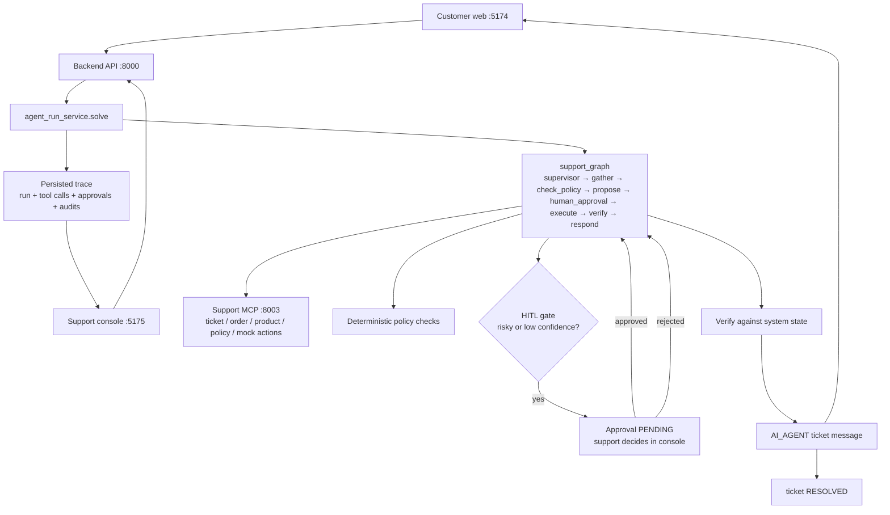
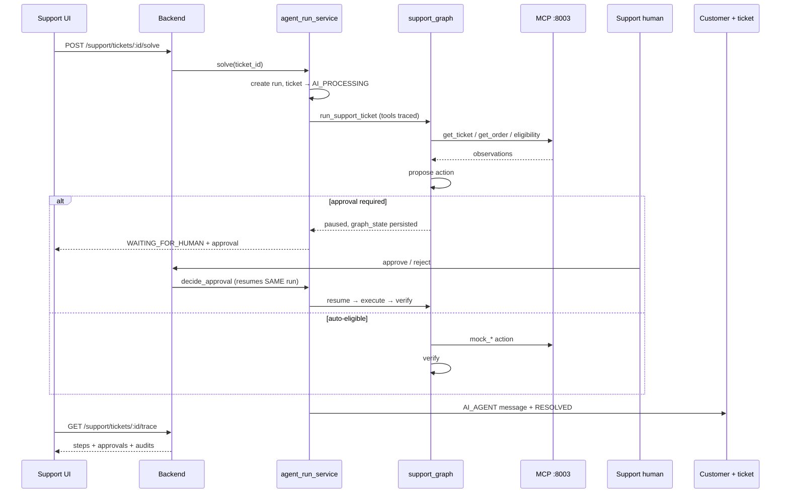
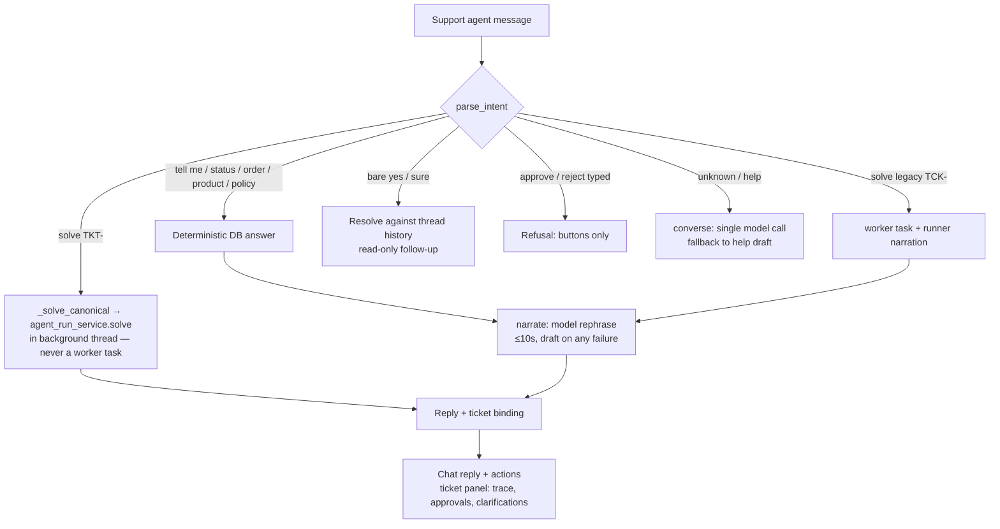

# northstar-worker — Autonomous AI Support Worker (Ecommerce)

An autonomous AI task worker for customer support: it takes a natural-language
request, resolves it against real tickets, orders, products and policies,
acts through tools, verifies the outcome, pauses for human approval when the
action is risky, and leaves a persisted trace plus a customer-visible answer.
Built as an internship-prototype submission: a narrow system that genuinely
runs, not a broad system of mocks.

## Problem

Support work arrives as free text ("my mug arrived broken, replace it").
A human agent must: understand the goal, load the ticket and order, check
policy, perform the action, verify it stuck, and reply to the customer —
escalating or asking for approval when unsure. This repo automates that loop:
one **Solve with AI** action drives classify → gather → policy check →
propose → human gate → execute → verify → respond, with every step persisted
and every risky action gated behind an explicit Approve / Reject decision.

## What the system does

- **Customer app** (`apps/customer-web`, `:5174`): signup/login, product
  browsing, cart, mock payment, order creation, customer ticket creation,
  ticket conversation where the AI answer appears.
- **Support console** (`apps/support-web`, `:5175`): staff login, support
  queue, ticket detail, manual replies, **Solve with AI**, AI activity trace,
  approval buttons, and a ticket-grounded support chat (`/chat`).
- **Backend** (`backend`, `:8000`, FastAPI): commerce APIs, canonical ticket
  APIs (`TKT-XXXXXX`), worker-task APIs (legacy `TCK-` path), chat,
  approvals, clarifications, evidence, events (SSE), evaluation, ops.
- **Agent** (`agent/support_graph`): the canonical LangGraph —
  supervisor → gather → check_policy → propose → human_approval →
  execute → verify → respond. Goal-oriented: the supervisor picks a
  workflow (REFUND / REPLACE / …) and each workflow loads only the tools
  its intent needs.
- **Tools** (`mcp_server`): two MCP servers. Task plane `:8002`
  (18 tools), support plane `:8003` (24 tools): ticket/order/product
  reads, eligibility checks, mock actions (`mock_refund`, `mock_return`,
  `mock_replace`, `mock_cancel_order`), knowledge search. No raw SQL;
  reads go through service clients with a service identity.
- **Persistence** (Postgres `:5433`, `database/`): `biz.customer_tickets`
  + messages, `biz.agent_runs` (with full `graph_state` checkpoint),
  `biz.tool_calls`, `biz.approvals` (24h TTL), `biz.audit_logs`,
  plus commerce tables. Migrations in `database/alembic/versions/`
  (head includes `0016_support_graph_state`).

## Architecture



## Canonical solve sequence



## Support chat flow



## Key technical decisions

- **One canonical path.** `Solve with AI` runs `agent_run_service.solve`
  → `agent/support_graph` → MCP → policy → HITL → verify → `AI_AGENT`
  message → `RESOLVED`. Chat `TKT-` solves launch the same run; the
  worker-task system is never used for canonical tickets (chat refuses
  clearly for unknown / resolved / already-running tickets instead of
  minting doomed tasks).
- **HITL that resumes, not restarts.** The paused run persists full
  `graph_state`; approve/reject resumes the same execution. Approvals
  expire after 24h; typed "yes" in chat never counts — decisions are
  button calls only.
- **Verify before claiming.** Mutations are re-checked against system
  state before the customer-facing message is saved; failures escalate
  with the run marked failed, never reported as success.
- **Model is a phraser, not the decider.** Intent routing, DB reads and
  side effects are deterministic; the LLM rephrases drafts (`narrate`)
  or answers open chat (`converse`), each a single call with a ~10s
  budget that falls back to the draft on any failure. Inception
  (`INCEPTION_API_KEY`) wins when set; Groq is the fallback; with
  neither key the drafts run the UI on their own.
- **Trace is persisted truth.** `GET /support/tickets/:id/trace` renders
  `agent_runs` + `tool_calls` + `approvals` + `audit_logs` — no generated
  filler. The timeline, approvals and clarifications in chat read the
  same rows.
- **Auth is fail-closed.** Public signup mints `CUSTOMER` only; staff
  surfaces need `SUPPORT_AGENT` JWT; ops login is credentialed;
  MCP service calls use an operator service token; production boot
  refuses insecure secrets.

## How to run

Prerequisites: Python 3.11+, Node 20+, Docker (Postgres), `INCEPTION_API_KEY`
for model-backed replies (optional — drafts work without it).

```powershell
# 1. env (never commit .env; .env.example documents every variable)
Copy-Item .env.example .env
# put INCEPTION_API_KEY=<key> into .env for model replies

# 2. database
docker compose up -d
docker exec northstar-postgres pg_isready -U postgres -d northstar

# 3. migrate + seed staff login (admin@northstar.shop)
python -m alembic -c database/alembic.ini upgrade head
python scripts/seed_support_admin.py

# 4. backend (:8000)
$env:PYTHONPATH='backend;common;agent;database;mcp_server;verifier;eval;browser'
python -m uvicorn app.main:app --app-dir backend --port 8000 --host 127.0.0.1
curl http://127.0.0.1:8000/api/health

# 5. MCP servers (:8002 task, :8003 support)
$env:PYTHONPATH='backend;common;agent;database;mcp_server'
python -m mcp_server.server
python -m mcp_server.support_server

# 6. frontends (separate shells; use cmd.exe, not Start-Process npm)
cd apps/customer-web; cmd.exe /c npm install; cmd.exe /c npm run dev   # :5174
cd apps/support-web;  cmd.exe /c npm install; cmd.exe /c npm run dev   # :5175
```

Note: on Windows the dev servers bind IPv6 localhost — open
`http://localhost:5174` and `http://localhost:5175` (not `127.0.0.1`).
Log in to support with the seeded `admin@northstar.shop`.

## Environment variables

| Variable | Purpose | Default / example |
|---|---|---|
| `INCEPTION_API_KEY` | Primary LLM provider key | unset (draft mode) |
| `INCEPTION_MODEL` / `INCEPTION_BASE_URL` | Model + endpoint | see `.env.example` |
| `GROQ_API_KEY` / `GROQ_MODEL` / `GROQ_BASE_URL` | Fallback provider, Inception unset only | unset |
| `LLM_TIMEOUT_S` / `LLM_MAX_RETRIES` | Model transport budget | `30` / `2` |
| `CHAT_USE_MODEL` / `CHAT_LLM_TIMEOUT_S` | Chat narration on/off + per-turn budget | `1` / `10` |
| `JWT_SECRET` | Staff/customer JWT signing | local dev default; required in prod |
| `OPERATOR_TOKEN` | MCP service identity | `local-operator-token` |
| `DATABASE_URL` / `NS_APP_DATABASE_URL` | Postgres roles (`:5433`) | see `.env.example` |
| `DELIVERY_DELAY_SECONDS` | Order delivery simulation | `60` |
| `SUPPORT_ADMIN_EMAIL` / `SUPPORT_ADMIN_PASSWORD` | Seed staff login | `admin@northstar.shop` / `admin` |
| `VITE_API_URL` | Frontend → backend URL | `http://localhost:8000` |

## Example walkthrough

1. Customer creates ticket `TKT-XXXXXX` about a broken item (`:5174`).
2. Support opens it (`:5175` → ticket page), clicks **Solve with AI**.
3. The graph loads ticket + order, checks replacement eligibility, and —
   low confidence or risky action — pauses `WAITING_FOR_HUMAN` with a
   `PENDING` approval.
4. Support approves; the same run executes `mock_replace`, verifies,
   writes the `AI_AGENT` reply, resolves the ticket.
5. The customer sees the answer in the ticket conversation; support
   watches the whole run in `GET /support/tickets/:id/trace`
   (steps + approvals + audits).
6. In `/chat`, `tell me about TKT-XXXXXX` grounds the thread; `yes`
   confirms read-only follow-ups; `solve ticket TKT-XXXXXX` launches
   the canonical run above — never a worker task.

## Models, APIs, frameworks, external services

- LLM: Inception-hosted chat model (OpenAI-compatible `/chat/completions`;
  model via `INCEPTION_MODEL` — `mercury-2.5` in `.env.example`,
  observed live as `muse-spark-1.3-contributor`), Groq fallback. Plain
  `httpx`, no agent framework beyond the repo's own LangGraph code.
- Backend: FastAPI + SQLAlchemy + Alembic + SSE (`sse-starlette`).
- Agent: hand-written LangGraph-style runner in `agent/support_graph`
  (no external graph library), deterministic policy layer, MCP tool
  clients, Argon2 passwords, PyJWT.
- Frontend: React + TypeScript + Vite + TanStack Query + axios.
- Infra: Docker Compose Postgres 16 + pgvector (`:5433`).
- No Kafka/Redis/Celery/microservices — deliberate prototype scope.

## Tests

```powershell
$env:PYTHONPATH='backend;common;agent;database;mcp_server;verifier;eval;browser'
python -m pytest tests/unit tests/integration -q
cd apps/support-web; cmd.exe /c npm run typecheck
```

Verified suites: chat intent parsing, chat runner retry, support-graph
behavior, HITL timeline builder, canonical solve (graph + HTTP
quarantine proving no worker task for `TKT-`), chat API, trace API
(waiting + fresh tickets), security blockers, HITL API — plus
`tsc --noEmit` clean on the support console. On Windows, run large
files in slices: cold pytest startup is ~8s per invocation.

## Limitations

- Worker-task tools bind the legacy (`TCK-`) ticket/order store only;
  canonical `TKT-` tickets resolve exclusively through the support
  graph — by design, but the two stores coexist.
- Mock commerce actions (`mock_refund`, …): no real payment provider.
- Chat narration budget (~10s/turn) means slow-model turns fall back
  to the deterministic draft rather than waiting.
- Test fixture ticket codes have 2-hex randomness; re-runs after
  killed runs can collide (`uq_tickets_code`) — delete stale
  `TCK-*` rows and re-run.
- Approvals expire after 24h; expired runs need staff takeover.

## Assumptions

- Local single-machine run (Windows PowerShell): Docker Postgres,
  processes on fixed ports, one operator.
- Demo seed identity `admin@northstar.shop` exists via
  `scripts/seed_support_admin.py`.
- `INCEPTION_API_KEY` present for model phrasing; absent → drafts.
- Reviewer runs backend with the repo-root `PYTHONPATH` above.

## What I would build next

1. Unify the legacy `TCK-` store into the canonical ticket model so
   worker tools and the support graph share one world.
2. Real payment/shipment adapters behind the current mock-action
   interface (signatures already action-shaped).
3. Webhook + email delivery of the `AI_AGENT` resolution to the customer.
4. Run-level concurrency guard UI (one active run per ticket is
   enforced; surfacing "who started what" is minimal).
5. Held-out scenario eval (`eval/held_out`) wired into CI.

## Demo video

Recording is maintained separately by the author. Reproduce it live:
seed → open `:5175` as `admin@northstar.shop` → pick a `TKT-` ticket →
**Solve with AI** → approve when asked → watch trace → confirm the
`AI_AGENT` reply on `:5174`, or drive the same flow from `/chat`.
