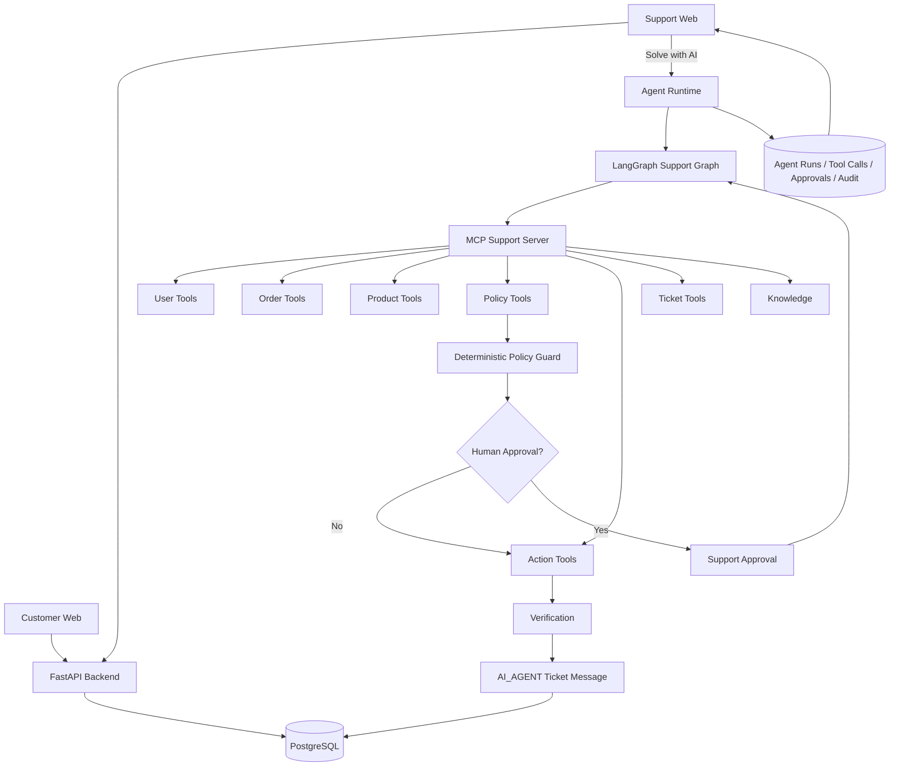
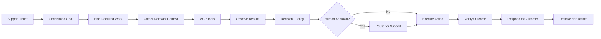
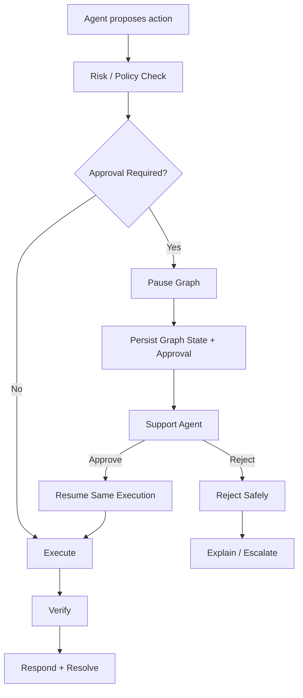
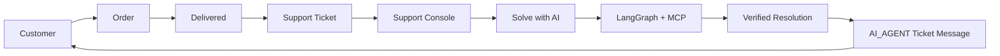

# Northstar — Autonomous AI Support Worker

> **A focused autonomous AI worker for ecommerce support that takes a high-level support goal, investigates the right context, uses controlled tools, applies deterministic policies, pauses for human approval when necessary, verifies the outcome, and communicates the result directly to the customer.**

[](#demo)
[](#architecture)
[](#technology-stack)

---

## Demo

**Demo video:** https://drive.google.com/file/d/1CWt96J_haSaje6e46PplN6DXoRO8StBe/view?usp=sharing

**Repository:** https://github.com/bkk07/northstar-worker

The recorded demo shows the complete support loop:

```text
Customer
  ↓
Purchase
  ↓
Order delivered
  ↓
Raise support ticket
  ↓
Support selects "Solve with AI"
  ↓
LangGraph agent investigates
  ↓
MCP tools + policy checks
  ↓
HITL when required
  ↓
Action execution
  ↓
Verification
  ↓
AI response written to ticket
  ↓
Customer sees the result
```

> **Before submission:** replace the demo URL placeholders and add the final screenshots listed in [Screenshots to Add](#screenshots-to-add).

---

## What I Built

Northstar is a prototype of an **autonomous AI task worker** applied to a realistic ecommerce support environment.

A support agent does not have to specify every action. Instead, the support agent gives the worker a goal:

> **"Solve this ticket."**

From there, the system can:

1. Understand the support request.
2. Determine what context is needed.
3. Retrieve relevant customer, order, product, and policy information through tools.
4. Decide what resolution is appropriate.
5. Apply deterministic business rules.
6. Ask for human approval when an action is risky or ambiguous.
7. Execute a controlled support action.
8. Verify that the requested outcome actually happened.
9. Write the final response directly into the customer ticket.
10. Resolve or escalate the ticket.

The ecommerce application exists to provide a realistic environment in which the autonomous worker can operate.

---

# Why This Is an Autonomous Worker

This project is intentionally **not just a conversational chatbot**.

The customer does not ask:

> "Call `get_order`, then check the policy, then create a replacement."

The support agent provides the outcome:

> **"Solve this ticket."**

The worker determines the intermediate steps.

The important distinction is:

```text
Chatbot
User → Question → Text Answer

Northstar
User → Goal
      ↓
   Reason
      ↓
   Gather
      ↓
   Use Tools
      ↓
   Observe
      ↓
   Decide
      ↓
   Act
      ↓
   Verify
      ↓
   Respond
```

The worker is evaluated on the **outcome it achieves**, not only on the text it generates.

---

# Core Capabilities

| Capability | What Northstar does |
|---|---|
| **Autonomy** | Starts from a high-level ticket goal instead of a step-by-step script |
| **Tool use** | Uses MCP tools for users, orders, products, policies, tickets, and support actions |
| **Observation** | Persists tool results and uses them to determine subsequent work |
| **Decision making** | Routes tickets and chooses the appropriate resolution workflow |
| **State** | Persists support graph state and execution information |
| **Reliability** | Handles transient failures, recovery, clarification, and escalation |
| **HITL** | Pauses risky work for support approval |
| **Verification** | Re-checks the outcome after mutations |
| **Evidence** | Provides trace, tool activity, approvals, audit records, and resolution state |
| **Customer delivery** | Writes the final AI response directly into the customer ticket |

---

# Product Surface

Northstar intentionally has **two separate web applications**.

## 1. Customer Web App

A realistic ecommerce experience where the customer can:

- Create an account
- Log in
- Browse products
- Search/filter the catalog
- View product details
- Add items to the cart
- Checkout
- Complete a simulated payment
- Track orders
- Wait for simulated delivery
- Raise a support ticket
- Continue the support conversation
- See the AI resolution

### Main routes

```text
/
 /login
 /signup
 /products
 /products/:id
 /cart
 /checkout
 /orders
 /orders/:id
 /support
 /tickets/:id
```

## 2. Support Web App

A separate support operations console where staff can:

- Log in
- View the ticket queue
- Search and filter tickets
- Open a ticket
- Inspect customer and order context
- Read the full conversation
- Reply manually
- Add internal notes
- Resolve or escalate manually
- Select **Solve with AI**
- Watch AI execution
- Review tool activity
- Approve or reject HITL requests
- Take over a ticket
- Inspect the final trace and resolution

### Main routes

```text
/login
/dashboard
/tickets
/tickets/:id
/chat
```

---

# Architecture

## High-Level Architecture



## Canonical Support Execution Path

The support ticket path is intentionally centered around one canonical execution pipeline:

```text
Support Agent
    ↓
Solve with AI
    ↓
agent_run_service.solve()
    ↓
agent/support_graph
    ↓
Goal understanding + planning
    ↓
MCP tools
    ↓
Deterministic policy
    ↓
Action proposal
    ↓
HITL when required
    ↓
Execute
    ↓
Verify
    ↓
Generate customer response
    ↓
AI_AGENT ticket message
    ↓
Resolve / Escalate
```

The canonical `TKT-XXXXXX` support flow does **not** detour into an unrelated worker task.

---

# Autonomous Ticket Execution



The agent should not blindly execute every available tool. The required context depends on the ticket.

For example:

### Tracking request

> "Where is my order?"

The worker needs order status/tracking information.

### Refund request

> "My phone arrived damaged. I want a refund."

The worker may need:

```text
Order
→ Order items
→ Product
→ Product policy
→ Refund eligibility
→ Refund action
→ Verification
```

---

# Human-in-the-Loop

HITL is part of the agent execution lifecycle.



Typical reasons to ask for human involvement include:

- High-value actions
- Low-confidence decisions
- Ambiguous context
- Repeated tool failures
- Requests requiring manual judgment

The support interface exposes the approval request without exposing private chain-of-thought.

---

# Verification

A successful tool response is not treated as proof that the requested outcome happened.

The system follows:

```text
Execute
   ↓
Verify
   ↓
Report success only when verified
```

For a replacement:

```text
mock_replace
    ↓
Re-check resulting state
    ↓
Verified
    ↓
Customer response
```

If verification fails or becomes inconclusive, the system can recover or escalate instead of claiming success.

---

# Reliability

Northstar includes several reliability mechanisms:

### Transient retry

Transient model/network/tool failures can be retried within bounded limits.

Permanent failures such as authorization or invalid input are not blindly retried.

### Recovery

When a safe retry is insufficient, the worker can move toward:

```text
Recovery
→ Clarification
→ Human assistance
→ Escalation
```

### Clarification

If the worker cannot safely identify the intended order or required context:

```text
AI
 ↓
Ask customer
 ↓
WAITING_FOR_CUSTOMER
 ↓
Customer replies
 ↓
Continue
```

### HITL

For decisions outside the worker's safe authority:

```text
WAITING_FOR_HUMAN
```

and the support agent decides what happens next.

### Idempotency

Support mutations use idempotency safeguards so repeated execution does not silently create duplicate business actions.

---

# Evidence and Observability

A support agent should be able to answer:

> **"What did the AI actually do?"**

Northstar records operational evidence such as:

```text
Agent run
Ticket
Intent / workflow
Tool calls
Tool results
Policy result
Action proposal
Approval decision
Verification result
Resolution
Timestamps
```

The support console exposes this through the ticket trace and live activity.

Example operational timeline:

```text
✓ Ticket understood
✓ Order context loaded
✓ Product policy checked
✓ Replacement eligibility confirmed
✓ Action proposed
✓ Approval requested
✓ Approval received
✓ Replacement executed
✓ Replacement verified
✓ Customer response generated
✓ Ticket resolved
```

This is operational trace data, not hidden model reasoning.

---

# Customer → Support → AI → Customer



The final AI response is persisted as an actual ticket message.

There is **no manual copy/paste step** between the support AI and the customer.

---

# Example: Damaged Product Replacement

Customer raises:

> **"My headphones arrived damaged. I want a replacement."**

The support agent clicks:

**Solve with AI**

The worker can then:

```text
1. Understand the request
2. Classify it as a replacement problem
3. Retrieve the relevant order context
4. Retrieve product/policy information
5. Check replacement eligibility
6. Determine whether approval is required
7. Execute the replacement action
8. Verify the resulting state
9. Generate the customer response
10. Save it as an AI_AGENT ticket message
11. Resolve the ticket
```

If approval is required:

```text
Propose
   ↓
WAITING_FOR_HUMAN
   ↓
Support approves
   ↓
Resume
   ↓
Execute
   ↓
Verify
   ↓
Respond
```

---

# Example: Ambiguous Request

Customer says:

> **"I want a refund."**

and the customer has multiple recent orders.

The worker should not guess.

Instead:

```text
Multiple possible orders
        ↓
Ask customer which order
        ↓
WAITING_FOR_CUSTOMER
```

The same ticket can then continue once the customer provides the missing context.

---

# Example: Failure

Suppose order lookup fails:

```text
get_order
   ↓
timeout
   ↓
retry
   ↓
failure
   ↓
human assistance / escalation
```

The customer should receive a safe support message, not an internal traceback or false success.

---

# Ecommerce Simulation

The ecommerce environment exists to create realistic support tasks.

## Purchase flow

```text
Product
  ↓
Cart / Buy
  ↓
Checkout
  ↓
Mock Payment
  ↓
Order Created
```

## Order lifecycle

```text
PROCESSING
    ↓
SHIPPED
    ↓
DELIVERED
```

Delivery is simulated so a support ticket can be raised against a real persisted order.

Payment, delivery, and support mutations are intentionally simulated for the prototype.

---

# Support Actions

The support environment includes controlled actions for common ecommerce cases:

```text
Refund
Return
Replacement
Cancellation
```

These are mocked business operations, but they still follow:

```text
Validate
→ Policy
→ Authorize
→ Execute
→ Verify
→ Audit
```

This keeps the prototype architecture replaceable with real providers later.

---

# MCP Tooling

The support agent accesses business capabilities through MCP.

## User

```text
get_user
get_user_orders
get_user_tickets
```

## Order

```text
get_order
get_order_items
get_order_status
get_order_tracking
```

## Product

```text
get_product
get_product_details
get_product_policy
```

## Policy

```text
check_refund_eligibility
check_return_eligibility
check_replacement_eligibility
check_cancellation_eligibility
```

## Actions

```text
mock_refund
mock_return
mock_replace
mock_cancel_order
```

## Ticket

```text
get_ticket
add_ticket_message
update_ticket
resolve_ticket
escalate_ticket
```

## Knowledge

```text
search_knowledge
```

The agent does not receive unrestricted database/SQL access.

---

# Why MCP?

MCP provides a structured tool boundary between the reasoning layer and business capabilities.

The AI can reason:

> "I need to check whether this order is eligible for replacement."

It can then use the appropriate capability rather than depending on internal database details.

This keeps the tool contract explicit and makes the agent easier to test and extend.

---

# Why LangGraph?

Support execution is stateful.

A ticket can involve:

- multiple tool calls
- conditional paths
- retries
- customer clarification
- human approval
- action execution
- verification
- escalation

LangGraph gives the worker explicit state and controlled transitions for those situations.

The important part is not simply "using LangGraph"; it is using it to manage a workflow whose execution can pause, continue, recover, and terminate safely.

---

# Why Deterministic Policies?

Business rules should not be invented by a language model.

For example:

```text
Order delivered 3 days ago
Return window = 7 days
→ Eligible
```

The policy layer provides the result.

The AI interprets the result and communicates it clearly.

This makes the system more predictable and easier to verify.

---

# Why Verification?

Without verification, an agent can say:

> "The refund was completed."

even if the underlying action failed.

Northstar instead follows:

```text
Action
 ↓
Re-read / verify
 ↓
Only then report success
```

This separates **attempted execution** from **confirmed completion**.

---

# Why Two Frontends?

The customer and support operator have fundamentally different jobs.

### Customer

```text
Browse
Buy
Track
Ask for help
Read resolution
```

### Support

```text
Triage
Investigate
Supervise AI
Approve
Take over
Resolve
Inspect evidence
```

Keeping these as separate applications makes the permissions and product experience clear.

---

# Technology Stack

| Layer | Technology |
|---|---|
| Customer frontend | React + Vite + TypeScript |
| Support frontend | React + Vite + TypeScript |
| UI | Tailwind CSS + shadcn/ui |
| Motion | Framer Motion |
| Server state | TanStack Query |
| Client state | Zustand |
| Backend | FastAPI |
| Validation | Pydantic |
| ORM | SQLAlchemy 2 |
| Migrations | Alembic |
| Database | PostgreSQL |
| Agent | LangGraph + LangChain |
| Model | Inception |
| Tools | MCP |
| Realtime | SSE |
| Authentication | JWT + Argon2 |
| Testing | pytest + integration/browser testing |
| Containerization | Docker Compose |

The browser tooling in the repository is isolated from the canonical customer-support ticket path.

---

# Repository Structure

```text
northstar-worker/
│
├── apps/
│   ├── customer-web/          # Customer storefront
│   └── support-web/           # Support console
│
├── backend/                   # FastAPI application
│   └── app/
│       ├── api/               # HTTP routes
│       ├── core/              # Auth, config, dependencies
│       ├── models/            # Database models
│       ├── schemas/           # API schemas
│       ├── services/          # Business/application services
│       └── repositories/      # Database access
│
├── agent/                     # AI worker
│   ├── support_graph/         # Canonical LangGraph support flow
│   ├── support/               # Support classification/policies
│   ├── policy/                # Deterministic rules
│   ├── llm/                   # Model client/configuration
│   └── runtime/               # Agent runtime utilities
│
├── mcp_server/                # MCP tool servers
│   ├── support/               # Canonical support tools
│   └── ...
│
├── database/                  # Database setup and migrations
├── common/                    # Shared configuration/logging
├── verifier/                  # Independent verification logic
├── browser/                   # Browser automation/perception
├── eval/                      # Evaluation scenarios
├── scripts/                   # Seed/setup/development utilities
├── tests/                     # Unit/integration/browser tests
├── docs/                      # Documentation and visual assets
│
├── docker-compose.yml
├── .env.example
├── pyproject.toml
└── README.md
```

The implementation is intentionally modular:

```text
API
 ↓
Service
 ↓
Repository
 ↓
Database
```

and:

```text
Agent
 ↓
LangGraph
 ↓
MCP / Policies / HITL / Verification
```

The project does not rely on a single giant source file for the application.

---

# Setup

## Prerequisites

- Python 3.11+
- Node.js 20+
- Docker + Docker Compose
- Git

Optional:

- `uv`
- Playwright / Chromium for browser tests

---

## 1. Environment

Create your local environment:

```powershell
Copy-Item .env.example .env
```

The `.env` file is intentionally ignored by Git.

Configure the required values, including the model credential for live AI execution:

```env
INCEPTION_API_KEY=your_key_here
INCEPTION_MODEL=mercury-2.5
INCEPTION_BASE_URL=https://api.inceptionlabs.ai/v1

DATABASE_URL=your_database_url
JWT_SECRET=your_local_secret
OPERATOR_TOKEN=your_local_operator_token
POLICY_TOKEN_SECRET=your_local_policy_secret

VITE_API_URL=http://localhost:8000
```

> Never commit real credentials.

---

## 2. Start PostgreSQL

```powershell
docker compose up -d
```

Run migrations:

```powershell
python -m alembic -c database/alembic.ini upgrade head
```

---

## 3. Start the Backend

Set the Python path:

```powershell
$env:PYTHONPATH='backend;common;agent;database;mcp_server;verifier;eval;browser'
```

Start FastAPI:

```powershell
python -m uvicorn app.main:app --app-dir backend --port 8000 --host 127.0.0.1
```

Health check:

```text
http://localhost:8000/api/health
```

---

## 4. Start Support MCP

```powershell
$env:PYTHONPATH='backend;common;agent;database;mcp_server'
python -m mcp_server.support_server
```

---

## 5. Start Customer Web

```powershell
cd apps/customer-web
npm install
cmd.exe /c npm run dev
```

Open:

```text
http://localhost:5174
```

---

## 6. Start Support Web

```powershell
cd apps/support-web
npm install
cmd.exe /c npm run dev
```

Open:

```text
http://localhost:5175
```

---

# Running the Demo

The recommended demo is intentionally narrow.

## Customer

1. Open the customer app.
2. Sign up and log in.
3. Browse `/products`.
4. Select a product.
5. Add it to the cart.
6. Complete checkout with the simulated payment.
7. Open the order.
8. Wait for the simulated lifecycle to reach `DELIVERED`.
9. Raise a support ticket.

Suggested ticket:

> **My headphones arrived damaged. I want a replacement.**

---

## Support

1. Open the support app.
2. Log in as a support agent.
3. Open the new ticket.
4. Inspect the customer/order/product context.
5. Click **Solve with AI**.
6. Watch the AI activity and tool calls.
7. If HITL is requested, approve or reject from the approval card.
8. Observe execution and verification.
9. Confirm that the ticket becomes resolved.

---

## Customer Verification

Return to the customer application.

Open the ticket and verify that the final AI response appears directly in the conversation.

The support agent should not need to copy/paste the response.

---

# Suggested Demo Story

For an interview or review, explain the demo in this order:

```text
1. Customer creates a realistic support problem.
2. Support receives the ticket with full business context.
3. Support gives the AI a goal instead of a step-by-step script.
4. LangGraph decides and coordinates the work.
5. MCP provides controlled capabilities.
6. Deterministic policies protect business rules.
7. HITL handles actions outside the worker's safe authority.
8. The action is verified.
9. The result is written directly to the customer ticket.
10. The support console exposes evidence of what happened.
```

This keeps the focus on **autonomous task execution**, not on the ecommerce UI itself.

---

# Problem Statement Alignment

| Evaluation criterion | Northstar implementation |
|---|---|
| **Autonomy** | Support gives the high-level objective "Solve this ticket"; the worker determines the required work |
| **Execution** | MCP tools and controlled support actions actually operate on persisted application state |
| **Reliability** | Bounded retries, recovery, clarification, HITL, terminal-state protection |
| **Verification** | Post-action verification is required before reporting success |
| **Generalization** | Multiple support intents share the same execution framework and tool layer |
| **Engineering Quality** | Separate applications, layered backend, LangGraph state, MCP boundaries, persistence, tests |
| **Product Thinking** | The system is organized around resolving the customer's underlying issue |
| **Technical Understanding** | Reasoning, tools, policy, approval, execution, verification, and evidence have explicit boundaries |

---

# Testing

The repository contains automated coverage for:

- authentication and authorization
- ticket behavior
- policy decisions
- LangGraph support execution
- MCP/tool interactions
- HITL behavior
- chat semantics
- retry/recovery behavior
- security
- integration paths
- frontend type checking/builds
- browser scenarios where applicable

Run backend tests:

```powershell
$env:PYTHONPATH='backend;common;agent;database;mcp_server;verifier;eval;browser'
python -m pytest tests/unit tests/integration -q
```

Run architecture/import checks where configured:

```powershell
python -m pytest tests/architecture -q
```

Run the frontends:

```powershell
cd apps/customer-web
cmd.exe /c npm run typecheck
cmd.exe /c npm run build
```

```powershell
cd apps/support-web
cmd.exe /c npm run typecheck
cmd.exe /c npm run build
```

Run browser tests when the required local services are running:

```powershell
python -m pytest tests/browser -q
```

> Test counts are intentionally not pinned in this README. Run the current suite to get the live result.

---

# Security

The prototype includes:

- JWT authentication
- Argon2 password hashing
- Role-based authorization
- Customer ownership checks
- Protected support operations
- Controlled MCP service identity
- Deterministic policy checks
- HITL for higher-risk actions
- Idempotent support mutations
- Environment-based secret management
- No arbitrary SQL tool exposed to the agent

Real credentials must remain outside the repository.

---

# Scope and Limitations

This submission deliberately focuses on a **controlled ecommerce support environment**.

### Simulated operations

The prototype simulates:

- payment
- delivery
- refund
- return
- replacement
- cancellation

These are application-level mock operations, not integrations with real financial or logistics providers.

### Controlled environment

The canonical support worker operates inside the application's ecommerce/support environment.

The repository also contains browser/worker tooling for experimentation, but the recorded canonical support-ticket flow does not depend on arbitrary third-party website automation.

### Local prototype

The system is designed to demonstrate the autonomous execution loop on a local stack without unnecessary distributed infrastructure.

---

# What I Would Build Next

With more time, I would extend the same architecture rather than replace it:

1. Connect real payment/refund and logistics providers behind the existing service boundaries.
2. Add richer external tools and browser-based environments.
3. Expand support workflows and held-out task evaluation.
4. Improve distributed execution and multi-worker observability.
5. Add richer evidence such as screenshots and structured before/after state.
6. Strengthen deployment-level service authentication and operational controls.

The prototype intentionally prioritizes a **narrow workflow that genuinely works** over a broad system with mostly simulated behavior.

---

# Screenshots to Add

Add the strongest screenshots to:

```text
docs/screenshots/
├── customer/
│   ├── home.png
│   ├── product-detail.png
│   ├── order-tracking.png
│   └── ticket.png
│
├── support/
│   ├── dashboard.png
│   └── ticket-detail.png
│
└── ai/
    ├── ai-copilot.png
    ├── hitl.png
    └── resolution.png
```

### Recommended final README images

Keep the README visually focused. The best three screenshots are:

```text
1. Customer product/order experience
2. Support ticket with customer + order context
3. AI Copilot / execution / HITL
```

Place them near the relevant sections rather than creating a long screenshot gallery.

---

# Demo Asset Checklist

Before submission, add:

```text
docs/
├── screenshots/
│   ├── customer/
│   ├── support/
│   └── ai/
└── demo/
    └── demo.mp4          # optional local copy
```

For the public submission, prefer linking the recorded demo from:

```text
YouTube
Loom
Google Drive
or another reviewer-accessible location
```

and replace:

```text
ADD_DEMO_VIDEO_URL
```

at the top of this README.

---

# Assumptions

- The ecommerce environment is simulated for the prototype.
- Support actions are performed against application data rather than real customer accounts.
- High-risk actions may require support approval.
- A customer ticket is the canonical unit of support work.
- PostgreSQL is the source of truth for application state and execution records.

---

# Submission Checklist

Before submitting, verify:

```text
[ ] GitHub repository is public/accessibly shared
[ ] README has the final demo link
[ ] No real API keys or secrets are committed
[ ] .env remains local
[ ] Screenshots have been added
[ ] Demo can be reproduced from the README
[ ] Customer frontend starts successfully
[ ] Support frontend starts successfully
[ ] Backend starts successfully
[ ] MCP support server starts successfully
[ ] Database migrations are current
[ ] Main tests are passing
[ ] Typecheck/build is passing
[ ] End-to-end demo has been run once from a clean state
```

---

# Final Takeaway

Northstar demonstrates an autonomous support worker rather than a response-only chatbot.

```text
High-level goal
      ↓
Understand
      ↓
Plan
      ↓
Use controlled tools
      ↓
Observe
      ↓
Apply policy
      ↓
Ask for human help when needed
      ↓
Execute
      ↓
Verify
      ↓
Provide evidence
      ↓
Communicate the result
```

The ecommerce surface provides the realistic environment.

The core contribution is the **autonomous execution loop** behind **Solve with AI**.
