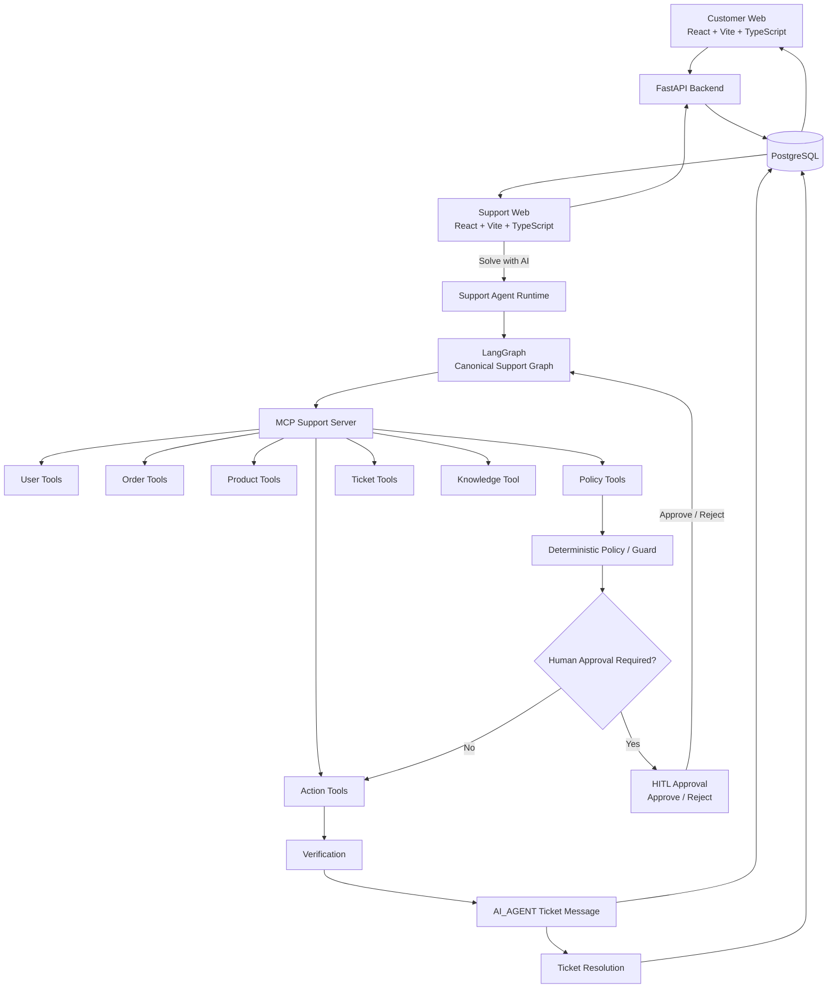
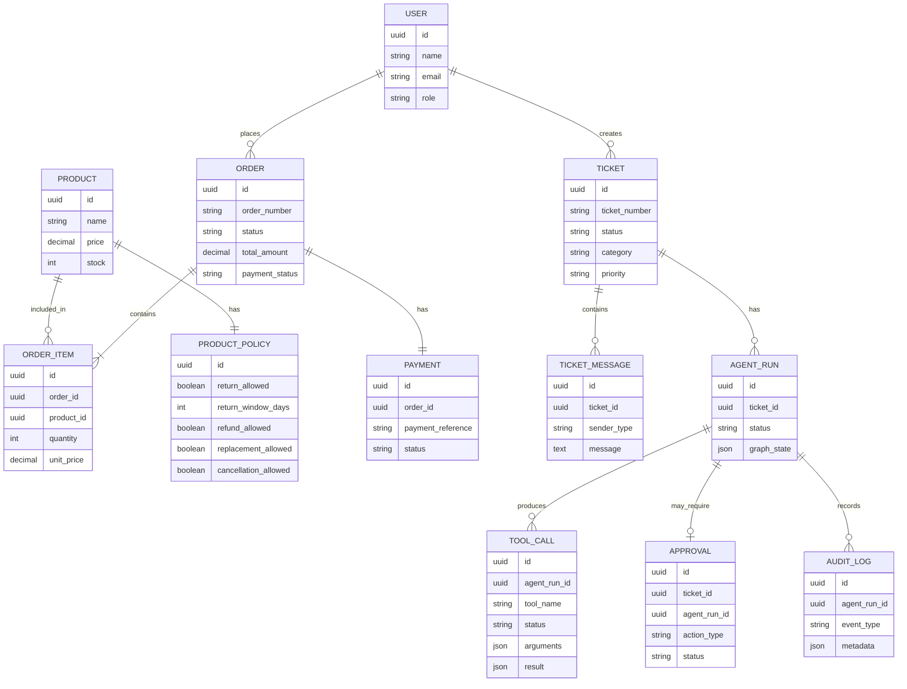
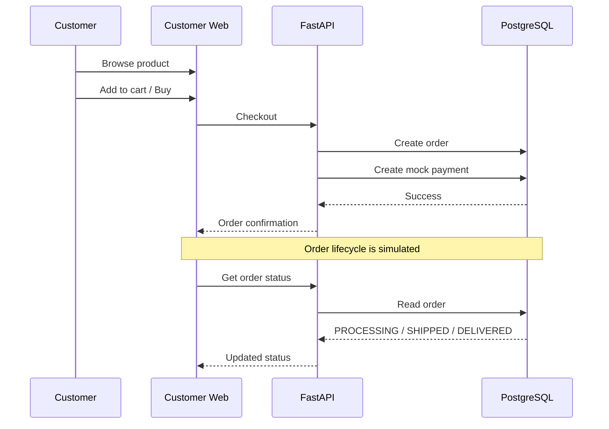
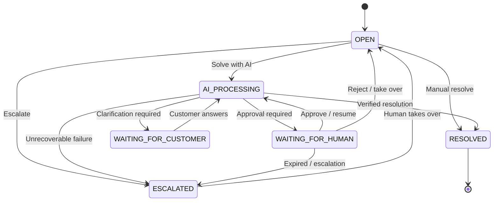
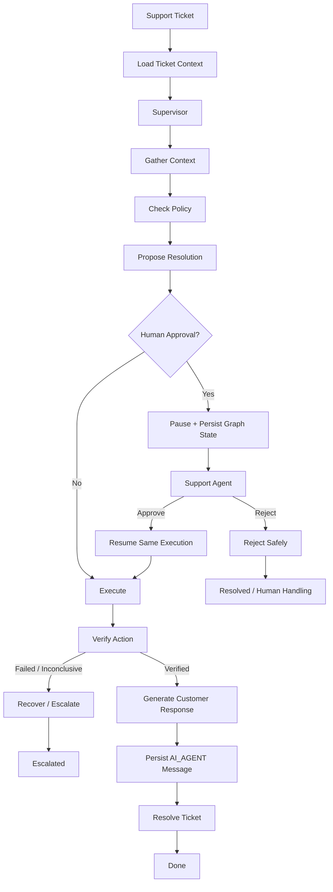
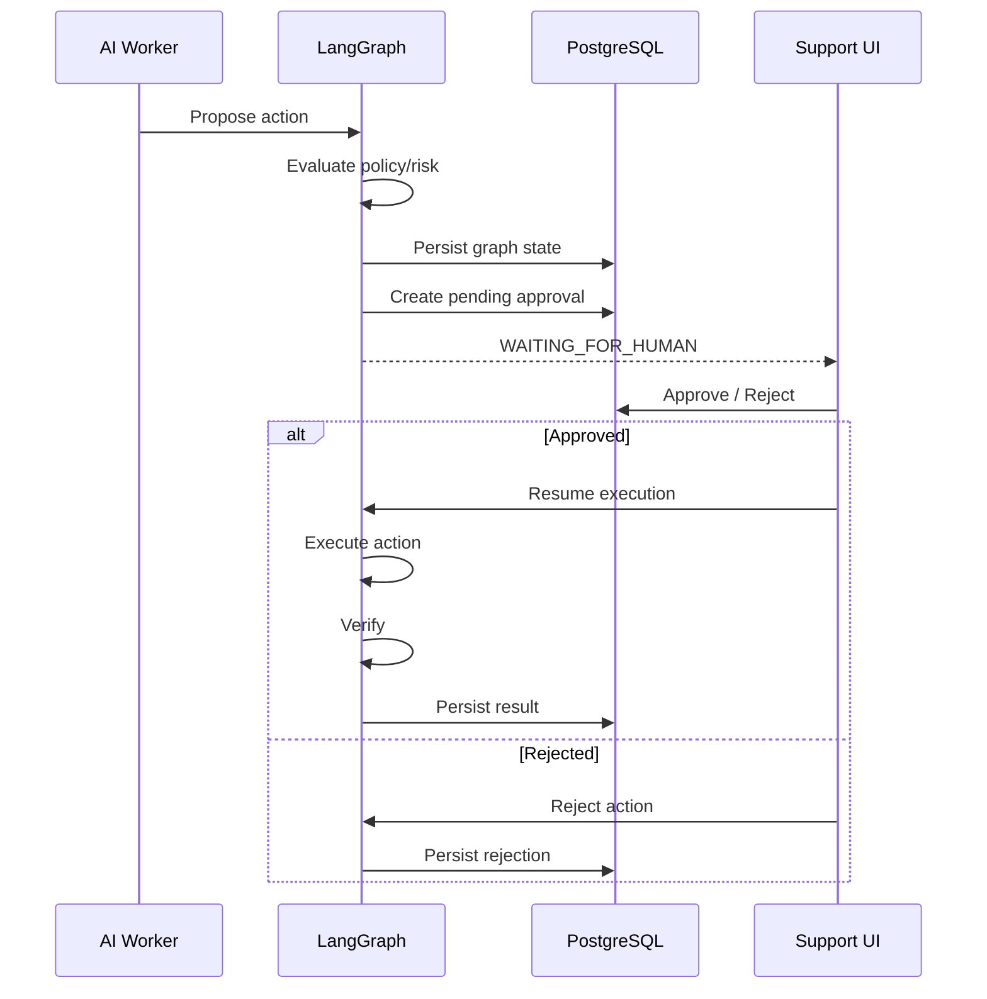
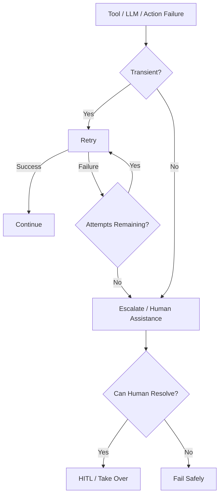
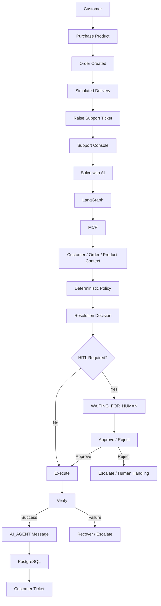

# Northstar — Architecture

## 1. Architecture Overview

Northstar is a focused autonomous AI customer-support worker built around a controlled ecommerce environment.

The system has **two independent frontend applications**:

- **Customer Web** — ecommerce experience, orders, and support tickets
- **Support Web** — support operations console, AI copilot, approvals, and ticket resolution

Both applications use the same FastAPI backend and PostgreSQL data model.

The canonical AI support path is:

```text
Support Agent
    │
    │ Solve with AI
    ▼
FastAPI Support API
    │
    ▼
agent_run_service.solve()
    │
    ▼
Canonical Support LangGraph
    │
    ▼
MCP Support Tools
    │
    ├── User
    ├── Order
    ├── Product
    ├── Policy
    ├── Ticket
    └── Actions
    │
    ▼
Deterministic Policy / Guard
    │
    ├── Safe → Execute
    │
    └── Risky / Ambiguous → HITL
                          │
                    Approve / Reject
                          │
                          ▼
                     Resume Graph
                          │
                          ▼
                       Execute
                          │
                          ▼
                       Verify
                          │
                          ▼
                  AI_AGENT Message
                          │
                          ▼
                    Ticket Resolved
                          │
                          ▼
                       Customer
```

The ecommerce layer creates realistic support situations. The AI worker is responsible for resolving the support ticket rather than simply generating a response.

---

# 2. System Architecture



---

# 3. Major Components

## 3.1 Customer Web

Location:

```text
apps/customer-web/
```

Purpose:

Provide the customer-facing ecommerce and support experience.

Main responsibilities:

- Authentication
- Product browsing
- Product details
- Cart
- Checkout
- Mock payment
- Order history
- Order tracking
- Ticket creation
- Ticket conversation

The customer frontend never directly accesses PostgreSQL or MCP.

Flow:

```text
Customer Web
    ↓
FastAPI
    ↓
Domain Services
    ↓
PostgreSQL
```

---

## 3.2 Support Web

Location:

```text
apps/support-web/
```

Purpose:

Provide the internal support-operations experience.

Main responsibilities:

- Support authentication
- Ticket queue
- Ticket filtering/search
- Ticket detail
- Customer context
- Order context
- Product/policy context
- Manual support
- AI resolution
- AI execution activity
- HITL approvals
- Takeover/escalation
- Resolution/audit view

Flow:

```text
Support Web
    ↓
FastAPI
    ↓
Support / Agent Services
    ↓
PostgreSQL
```

For AI resolution:

```text
Support Web
    ↓
FastAPI
    ↓
Agent Runtime
    ↓
LangGraph
```

---

# 4. Backend Architecture

Location:

```text
backend/
```

The backend follows a layered architecture.

```text
HTTP Router / Controller
        ↓
Service Layer
        ↓
Repository Layer
        ↓
PostgreSQL
```

## API Layer

Responsible for:

- HTTP request handling
- Authentication dependencies
- Request validation
- Response schemas
- Route-level authorization

Examples:

```text
/api/auth
/api/products
/api/cart
/api/checkout
/api/orders
/api/tickets
/api/support
```

AI-related support routes include:

```text
/support/tickets/:id/solve
/support/tickets/:id/trace
/support/tickets/:id/activity
/support/approvals/:id/decision
```

The API layer should not contain large amounts of business logic.

---

## Service Layer

Responsible for business behavior.

Examples:

```text
auth_service
product_service
cart_service
order_service
ticket_service
support_service
agent_run_service
approval_service
audit_service
```

The canonical AI support orchestration begins at:

```text
agent_run_service.solve()
```

---

## Repository Layer

Responsible for persistence-oriented database access.

Repositories keep database queries separate from:

- HTTP logic
- Agent logic
- UI logic

---

# 5. Database Architecture

PostgreSQL is the system's source of truth.

Core conceptual model:



The important relationships are:

```text
User
 ├── Orders
 └── Tickets

Order
 └── Order Items
       └── Product

Product
 └── Product Policy

Ticket
 └── Ticket Messages

Agent Run
 ├── Tool Calls
 ├── Approval
 └── Audit Logs
```

---

# 6. Customer Purchase Flow

The ecommerce side creates the state that support later operates on.



The prototype simulates:

```text
PROCESSING
    ↓
SHIPPED
    ↓
DELIVERED
```

with an approximately one-minute delivery window for the demo.

No real payment gateway or logistics provider is required.

---

# 7. Ticket Lifecycle



The exact transitions are enforced by backend services rather than only by UI state.

---

# 8. Canonical LangGraph Support Execution

The support AI uses a canonical LangGraph rather than a disconnected worker-task workflow.



The graph is stateful.

Important state includes:

```text
ticket_id
user_id
order_id
intent
customer_context
order_context
product_context
policy_context
tool_results
decision
proposed_action
approval_required
approval_status
human_feedback
action_result
verification_result
resolution
escalation state
```

Graph state is persisted so that HITL can pause execution without losing context.

---

# 9. Goal-Oriented Planning

The worker is not designed as:

```text
get_user
→ get_orders
→ get_order
→ get_product
→ refund
```

for every ticket.

Instead, the support goal determines the required context.

Example:

```text
Ticket:
"Where is my order?"
```

Possible execution:

```text
Understand
    ↓
Order / Delivery workflow
    ↓
Get order
    ↓
Get status / tracking
    ↓
Respond
```

Another example:

```text
Ticket:
"My phone arrived damaged. I want a refund."
```

Possible execution:

```text
Understand
    ↓
Refund workflow
    ↓
Get relevant order/product context
    ↓
Check refund policy
    ↓
Determine approval requirement
    ↓
Refund if permitted
    ↓
Verify
    ↓
Respond
```

The agent chooses the work required by the goal.

---

# 10. MCP Architecture

The canonical support worker uses the Support MCP server.

```text
LangGraph
    ↓
MCP Support Server
    │
    ├── User
    ├── Order
    ├── Product
    ├── Policy
    ├── Actions
    ├── Ticket
    └── Knowledge
```

## User tools

```text
get_user
get_user_orders
get_user_tickets
```

## Order tools

```text
get_order
get_order_items
get_order_status
get_order_tracking
```

## Product tools

```text
get_product
get_product_details
get_product_policy
```

## Policy tools

```text
check_refund_eligibility
check_return_eligibility
check_replacement_eligibility
check_cancellation_eligibility
```

## Action tools

```text
mock_refund
mock_return
mock_replace
mock_cancel_order
```

## Ticket tools

```text
get_ticket
add_ticket_message
update_ticket
resolve_ticket
escalate_ticket
```

## Knowledge

```text
search_knowledge
```

The MCP layer exposes capabilities rather than unrestricted database operations.

There is no arbitrary SQL tool.

---

# 11. Policy and Action Boundary

A core design principle is:

```text
LLM
 ↓
Reason / Propose
 ↓
Policy + Authorization
 ↓
Execute
 ↓
Verify
```

The LLM does not directly decide that a refund is allowed.

The deterministic policy layer evaluates the relevant rules.

Example:

```text
Requested action: REFUND
Order: ORD-123
Amount: ₹1,299

        ↓

Refund Eligibility
        ↓
Eligible = true

        ↓

Risk / Approval Policy
        ↓
Approval required = false

        ↓

Execute mock_refund
```

For a higher-risk action:

```text
Refund: ₹50,000

        ↓

Policy
        ↓
Eligible

        ↓

Risk rule
        ↓
HITL required

        ↓
WAITING_FOR_HUMAN
```

---

# 12. HITL Architecture

HITL is integrated into the LangGraph lifecycle.



Approval records contain enough information to associate the decision with:

```text
ticket
agent run
action
support agent
timestamp
decision
human note
expiry
```

Approval buttons are intentionally used for protected actions rather than interpreting casual conversational text as authorization.

---

# 13. Customer-Facing Response Flow

The AI does not return the final message only to the support UI.

The final response becomes a real ticket message.

```text
AI Worker
    ↓
Generate Response
    ↓
ticket_messages
    ↓
sender_type = AI_AGENT
    ↓
Customer Ticket API
    ↓
Customer Web
```

This creates one shared conversation between:

```text
CUSTOMER
AI_AGENT
SUPPORT_AGENT
SYSTEM
```

The support agent can supervise the process, but does not need to copy/paste the AI's response into the customer conversation.

---

# 14. Verification Architecture

Verification is independent from the claim of success.

```text
Execute action
      ↓
Read current state
      ↓
Evaluate expected invariant
      ↓
Verified?
   ┌──┴──┐
  YES    NO
   │      │
   ▼      ▼
Success  Recover / Escalate
```

For support actions, the verification layer checks that the expected business state changed.

For example:

```text
Before:
replacement eligible = true

mock_replace()

After:
replacement eligible = false
replacement record exists
```

Only then is the result considered verified.

---

# 15. Failure and Recovery

The worker distinguishes recoverable failures from failures requiring human intervention.



The system should never convert a failed action into a successful customer message.

---

# 16. Observability

Every meaningful AI run has an operational trail.

The system records:

```text
Agent Run
 ├── intent
 ├── workflow
 ├── status
 ├── graph state
 ├── decision
 ├── error
 └── verification result

Tool Calls
 ├── tool name
 ├── arguments
 ├── result
 ├── status
 └── timing

Approval
 ├── action
 ├── status
 ├── approver
 ├── note
 └── expiry

Audit Logs
 ├── event
 ├── actor
 ├── timestamp
 └── metadata
```

The support UI exposes a safe operational trace.

It does **not** expose private model chain-of-thought.

---

# 17. Authentication and Authorization

There are two main roles:

```text
CUSTOMER
SUPPORT_AGENT
```

## Customer

Can access only their own:

```text
profile
cart
orders
tickets
ticket messages
```

## Support Agent

Can access:

```text
support queue
tickets
customer context
order context
AI runs
approvals
support actions
```

Authentication is handled with:

```text
JWT
Argon2
Role-based authorization
Server-side ownership checks
```

Public customer registration always creates a `CUSTOMER`.

Support identities are not created through public self-registration.

---

# 18. Repository Structure

```text
northstar-worker/
│
├── apps/
│   ├── customer-web/
│   └── support-web/
│
├── backend/
│   └── app/
│       ├── api/
│       ├── core/
│       ├── models/
│       ├── schemas/
│       ├── services/
│       ├── repositories/
│       └── sse/
│
├── agent/
│   ├── support_graph/
│   │   ├── state.py
│   │   ├── planner.py
│   │   ├── nodes.py
│   │   ├── graph.py
│   │   └── runner.py
│   ├── support/
│   ├── llm/
│   └── policy/
│
├── mcp_server/
│   ├── support_server.py
│   ├── server.py
│   └── support/
│       ├── user_tools.py
│       ├── order_tools.py
│       ├── product_tools.py
│       ├── policy_tools.py
│       ├── action_tools.py
│       ├── ticket_tools.py
│       └── knowledge_tools.py
│
├── database/
│   ├── models/
│   └── alembic/
│
├── common/
├── browser/
├── verifier/
├── eval/
├── tests/
├── scripts/
│
├── docs/
│   ├── architecture.md
│   ├── CustomerProducts.png
│   ├── CustomerOrders.png
│   ├── CustomerTickets.png
│   ├── CustomerTicketAfterResoved.png
│   ├── SupportTickets.png
│   ├── SupportAIChat1.png
│   └── SupportAIChat2.png
├── docker-compose.yml
├── .env.example
├── pyproject.toml
└── README.md
```

Each part has a defined responsibility.

There should be no requirement for a single monolithic `main.py`, `agent.py`, `App.tsx`, or `mcp_server.py` containing the whole system.

---

# 19. Runtime Topology

Typical local development topology:

```text
Customer Web       :5174
Support Web        :5175
FastAPI            :8000
Task MCP           :8002
Support MCP        :8003
PostgreSQL         :5433
```

The canonical support-ticket AI flow uses the **Support MCP** service.

The separate task/browser plane is not the canonical ticket-solving path.

---

# 20. Technology Responsibilities

| Component | Responsibility |
|---|---|
| React / TypeScript | Web application interfaces |
| Tailwind / shadcn/ui | Design system and UI primitives |
| FastAPI | API and backend application layer |
| PostgreSQL | Persistent source of truth |
| SQLAlchemy | Database access |
| Alembic | Database migrations |
| JWT / Argon2 | Authentication |
| LangGraph | Stateful agent orchestration |
| LangChain | LLM/tool interfaces |
| Inception | Model used by the agent |
| MCP | Controlled business tool interface |
| SSE | Live support activity |
| Playwright | Browser capability for isolated task-plane workflows |
| pytest | Backend/agent testing |
| Docker Compose | Local service orchestration |

---

# 21. Design Principles

## Goal over procedure

The support agent receives an outcome-oriented objective rather than a predetermined sequence of tool calls.

## LLM for reasoning

The model helps understand, classify, plan, and communicate.

## Deterministic business rules

Policies decide what is actually allowed.

## Controlled capabilities

MCP exposes explicit business operations.

## Human authority for risky actions

HITL provides a controlled approval boundary.

## Verify before reporting success

The system checks actual state after important actions.

## One canonical support execution path

A support ticket should be resolved through the canonical LangGraph workflow rather than a disconnected task system.

## Persistent state

Important agent state, approvals, tool calls, and audit records are persisted.

## Simple infrastructure

The prototype avoids unnecessary infrastructure that does not improve the demonstrated workflow.

---

# 22. End-to-End Reference Flow



---

# 23. What This Architecture Optimizes For

This architecture is intentionally optimized for the internship problem's most important dimensions:

```text
Autonomy
    ↓
Execution
    ↓
Reliability
    ↓
Verification
    ↓
Human Control
    ↓
Evidence
```

The ecommerce layer is intentionally narrow.

The important part is the autonomous support worker operating within that environment.

The worker is expected to answer:

> **Given a support goal, can the system determine what needs to happen, perform the work, handle uncertainty, verify the result, and communicate the outcome?**

That is the central architectural objective of Northstar.
